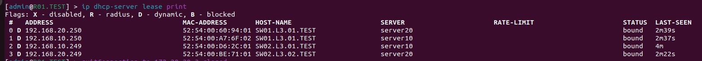


University: <a href="https://itmo.ru/ru/">ITMO University</a>

Faculty: <a href="https://fict.itmo.ru">FICT</a>

Course: <a href="https://github.com/itmo-ict-faculty/introduction-in-routing">Introduction in routing</a>

Year: 2022/2023

Group: K33212

Author: Potitova Valentina Alexandrovna

Lab: Lab1

Date of create: 18.11.2022

Date of finished: 02.12.2022

<h1>Лаборторная работа №1</h1>

<h2>Установка ContainerLab и развертывание тестовой сети связи</h2>

<h3>Цель работы</h3>

Ознакомиться с инструментом ContainerLab и методами работы с ним, изучить работу VLAN, IP адресации.

<h3>Результаты работы</h3>

<ol>

<li>Файл, который использовался для развертывания тестовой сети находится в папке с лабораторной работой. Имя файла: "lab1.yaml".</li>

<li>Схема связи находится в папке с лабораторной работой. Имя файла: "Схема.jpeg"</li>
</ol>

<h4>Текст конфигураций для каждого сетевого устройства</h4>
<h5>R01.TEST (sudo ssh admin@172.20.20.3)</h5>
<pre><code>
/interface vlan
add interface=ether2 name=vlan10 vlan-id=10
add interface=ether2 name=vlan20 vlan-id=20
/interface wireless security-profiles
set [ find default=yes ] supplicant-identity=MikroTik
/ip pool
add name=pool10 ranges=192.168.10.10-192.168.10.250
add name=pool20 ranges=192.168.20.10-192.168.20.250
/ip dhcp-server
add address-pool=pool10 disabled=no interface=vlan10 name=server10
add address-pool=pool20 disabled=no interface=vlan20 name=server20
/ip address
add address=172.31.255.30/30 interface=ether1 network=172.31.255.28
add address=192.168.10.1/24 interface=vlan10 network=192.168.10.0
add address=192.168.20.1/24 interface=vlan20 network=192.168.20.0
/ip dhcp-client
add disabled=no interface=ether1
/ip dhcp-server network
add address=192.168.10.0/24 gateway=192.168.10.1
add address=192.168.20.0/24 gateway=192.168.20.1
/system identity
set name=R01.TEST
</code></pre>

<h5>SW01.L3.01.TEST (sudo ssh admin@172.20.20.4)</h5>
<pre><code>
/interface bridge
add name=bridge10
add name=bridge20
/interface vlan
add interface=ether2 name=vlan10 vlan-id=10
add interface=ether2 name=vlan20 vlan-id=20
add interface=ether3 name=vlan103 vlan-id=10
add interface=ether4 name=vlan203 vlan-id=20
/interface wireless security-profiles
set [ find default=yes ] supplicant-identity=MikroTik
/interface bridge port
add bridge=bridge20 interface=vlan20
add bridge=bridge20 interface=vlan203
add bridge=bridge10 interface=vlan103
add bridge=bridge10 interface=vlan10
/ip address
add address=172.31.255.30/30 interface=ether1 network=172.31.255.28
/ip dhcp-client
add disabled=no interface=ether1
add disabled=no interface=bridge10
add disabled=no interface=bridge20
/system identity
set name=SW01.L3.01.TEST
</pre></code>

<h5>SW02.L3.01.TEST (sudo ssh admin@172.20.20.7)</h5>
<pre><code>
/interface bridge
add name=bridge10
/interface vlan
add interface=ether2 name=vlan10 vlan-id=10
/interface wireless security-profiles
set [ find default=yes ] supplicant-identity=MikroTik
/interface bridge port
add bridge=bridge10 interface=vlan10
add bridge=bridge10 interface=ether3
/ip address
add address=172.31.255.30/30 interface=ether1 network=172.31.255.28
/ip dhcp-client
add disabled=no interface=ether1
add disabled=no interface=bridge10
/system identity
set name=SW02.L3.01.TEST
</pre></code>

<h5>SW02.L3.02.TEST (sudo ssh admin@172.20.20.5)</h5>
<pre><code>
/interface bridge
add name=bridge20
/interface vlan
add interface=ether2 name=vlan20 vlan-id=20
/interface wireless security-profiles
set [ find default=yes ] supplicant-identity=MikroTik
/interface bridge port
add bridge=bridge20 interface=vlan20
add bridge=bridge20 interface=ether3
/ip address
add address=172.31.255.30/30 interface=ether1 network=172.31.255.28
/ip dhcp-client
add disabled=no interface=ether1
add disabled=no interface=bridge20
/system identity
set name=SW02.L3.02.TEST
</pre></code>

<h4>Результаты пингов, проверки локальной связности</h4>

