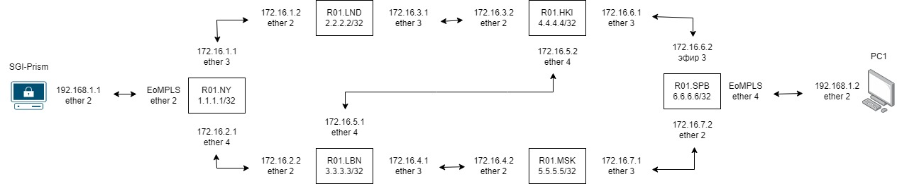
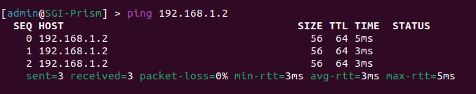
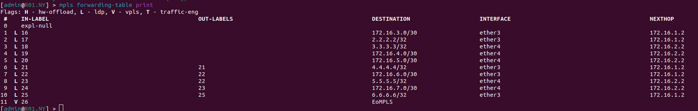
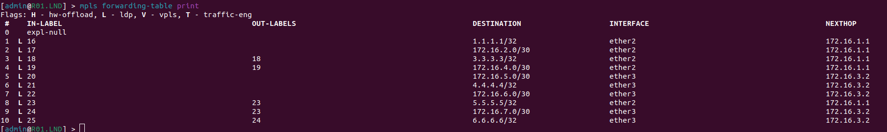
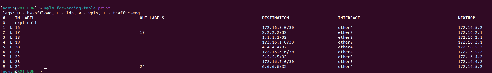
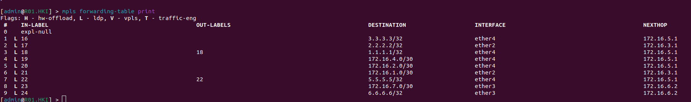
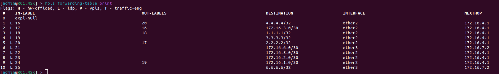
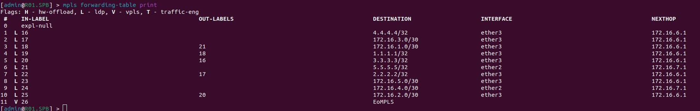

University: <a href="https://itmo.ru/ru/">ITMO University</a>

Faculty: <a href="https://fict.itmo.ru">FICT</a>

Course: <a href="https://github.com/itmo-ict-faculty/introduction-in-routing">Introduction in routing</a>

Year: 2022/2023

Group: K33212

Author: Potitova Valentina Alexandrovna

Lab: Lab3

Date of create: 03.12.2022

Date of finished: 26.12.2022

<h1>Лаборторная работа №3</h1>
<h2>Эмуляция распределенной корпоративной сети связи, настройка OSPF и MPLS, организация первого EoMPLS</h2>

<h3>Цель работы</h3>

Изучить протоколы OSPF и MPLS, механизмы организации EoMPLS.

<h3>Результаты работы</h3>

<ul>
<li>Файл, который использовался для развертывания тестовой сети находится в папке с лабораторной работой. Имя файла: "lab3.yaml".</li>
</ul>

<h4>Cхема связи</h4>

<h4>Текст конфигураций для каждого сетевого устройства</h4>
<h5>R01.NY</h5>
<pre><code>
/interface bridge
add name=EoMPLS_B
add name=Lo0
/interface vpls
add cisco-style=yes cisco-style-id=666 disabled=no l2mtu=1500 mac-address=02:3F:B8:F3:CB:64
name=EoMPLS remote-peer=6.6.6.6
/interface wireless security-profiles
set [ find default=yes ] supplicant-identity=MikroTik
/routing ospf instance
set [ find default=yes ] router-id=1.1.1.1
/interface bridge port
add bridge=EoMPLS_B interface=EoMPLS
add bridge=EoMPLS_B interface=ether2
/ip address
add address=172.31.255.30/30 interface=ether1 network=172.31.255.28
add address=172.16.1.1/30 interface=ether3 network=172.16.1.0
add address=172.16.2.1/30 interface=ether4 network=172.16.2.0
add address=1.1.1.1/32 interface=Lo0 network=1.1.1.1
/ip dhcp-client
add disabled=no interface=ether1
/mpls ldp
set enabled=yes transport-address=1.1.1.1
/mpls ldp interface
add interface=ether3
add interface=ether4
/routing ospf network
add area=backbone
/system identity
set name=R01.NY
</pre></code>

<h5>R01.LND</h5>
<pre><code>
/interface bridge
add name=Lo0
/interface wireless security-profiles
set [ find default=yes ] supplicant-identity=MikroTik
/routing ospf instance
set [ find default=yes ] router-id=2.2.2.2
/ip address
add address=172.31.255.30/30 interface=ether1 network=172.31.255.28
add address=172.16.1.2/30 interface=ether2 network=172.16.1.0
add address=172.16.3.1/30 interface=ether3 network=172.16.3.0
add address=2.2.2.2/32 interface=Lo0 network=2.2.2.2
/ip dhcp-client
add disabled=no interface=ether1
/mpls ldp
set enabled=yes transport-address=2.2.2.2
/mpls ldp interface
add interface=ether2
add interface=ether3
/routing ospf network
add area=backbone
/system identity
set name=R01.LND
</pre></code>

<h5>R01.LBN</h5>
<pre><code>
/interface bridge
add name=Lo0
/interface wireless security-profiles
set [ find default=yes ] supplicant-identity=MikroTik
/routing ospf instance
set [ find default=yes ] router-id=3.3.3.3
/ip address
add address=172.31.255.30/30 interface=ether1 network=172.31.255.28
add address=172.16.2.2/30 interface=ether2 network=172.16.2.0
add address=172.16.4.1/30 interface=ether3 network=172.16.4.0
add address=172.16.5.1/30 interface=ether4 network=172.16.5.0
add address=3.3.3.3/32 interface=Lo0 network=3.3.3.3
/ip dhcp-client
add disabled=no interface=ether1
/mpls ldp
set enabled=yes transport-address=3.3.3.3
/mpls ldp interface
add interface=ether2
add interface=ether3
add interface=ether4
/routing ospf network
add area=backbone
/system identity
set name=R01.LBN
</pre></code>

<h5>R01.HKI</h5>
<pre><code>
/interface bridge
add name=Lo0
/interface wireless security-profiles
set [ find default=yes ] supplicant-identity=MikroTik
/routing ospf instance
set [ find default=yes ] router-id=4.4.4.4
/ip address
add address=172.31.255.30/30 interface=ether1 network=172.31.255.28
add address=172.16.3.2/30 interface=ether2 network=172.16.3.0
add address=172.16.6.1/30 interface=ether3 network=172.16.6.0
add address=172.16.5.2/30 interface=ether4 network=172.16.5.0
add address=4.4.4.4/32 interface=Lo0 network=4.4.4.4
/ip dhcp-client
add disabled=no interface=ether1
/mpls ldp
set enabled=yes transport-address=4.4.4.4
/mpls ldp interface
add interface=ether2
add interface=ether3
add interface=ether4
/routing ospf network
add area=backbone
/system identity
set name=R01.HKI
</pre></code>

<h5>R01.MSK</h5>
<pre><code>
/interface bridge
add name=Lo0
/interface wireless security-profiles
set [ find default=yes ] supplicant-identity=MikroTik
/routing ospf instance
set [ find default=yes ] router-id=5.5.5.5
/ip address
add address=172.31.255.30/30 interface=ether1 network=172.31.255.28
add address=172.16.4.2/30 interface=ether2 network=172.16.4.0
add address=172.16.7.1/30 interface=ether3 network=172.16.7.0
add address=5.5.5.5/32 interface=Lo0 network=5.5.5.5
/ip dhcp-client
add disabled=no interface=ether1
/mpls ldp
set enabled=yes transport-address=5.5.5.5
/mpls ldp interface
add interface=ether2
add interface=ether3
/routing ospf network
add area=backbone
/system identity
set name=R01.MSK
</pre></code>

<h5>R01.SPB</h5>
<pre><code>
/interface bridge
add name=EoMPLS_B
add name=Lo0
/interface vpls
add cisco-style=yes cisco-style-id=666 disabled=no l2mtu=1500 mac-address=02:3C:7A:86:AF:B3
name=EoMPLS remote-peer=1.1.1.1
/interface wireless security-profiles
set [ find default=yes ] supplicant-identity=MikroTik
/routing ospf instance
set [ find default=yes ] router-id=6.6.6.6
/interface bridge port
add bridge=EoMPLS_B interface=EoMPLS
add bridge=EoMPLS_B interface=ether4
/ip address
add address=172.31.255.30/30 interface=ether1 network=172.31.255.28
add address=172.16.7.2/30 interface=ether2 network=172.16.7.0
add address=172.16.6.2/30 interface=ether3 network=172.16.6.0
add address=6.6.6.6/32 interface=Lo0 network=6.6.6.6
/ip dhcp-client
add disabled=no interface=ether1
/mpls ldp
set enabled=yes transport-address=6.6.6.6
/mpls ldp interface
add interface=ether2
add interface=ether3
/routing ospf network
add area=backbone
/system identity
set name=R01.SPB
</pre></code>

<h5>SGI-Prism</h5>
<pre><code>
/interface wireless security-profiles
set [ find default=yes ] supplicant-identity=MikroTik
/ip address
add address=172.31.255.30/30 interface=ether1 network=172.31.255.28
add address=192.168.1.1/24 interface=ether2 network=192.168.1.0
/ip dhcp-client
add disabled=no interface=ether1
/system identity
set name=SGI-Prism
</pre></code>

<h5>PC1</h5>
<pre><code>
/interface wireless security-profiles
set [ find default=yes ] supplicant-identity=MikroTik
/ip address
add address=172.31.255.30/30 interface=ether1 network=172.31.255.28
add address=192.168.1.2/24 interface=ether2 network=192.168.1.0
/ip dhcp-client
add disabled=no interface=ether1
/system identity
set name=PC1
</pre></code>

<h4>Результаты пингов, проверки локальной связности</h4>

<h4>Выкладки с маршрутами на каждом устройстве</h4>

<h3>Вывод</h3>

Были изучены протоколы OSPF и MPLS, механизмы организации EoMPLS.
