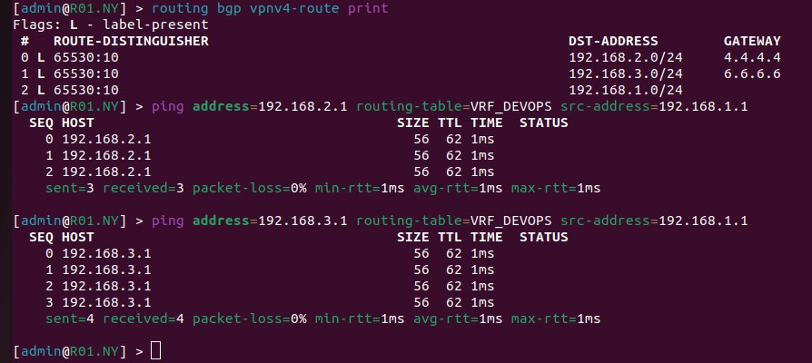
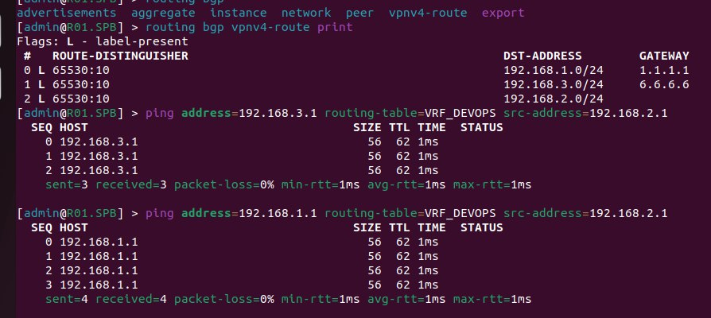
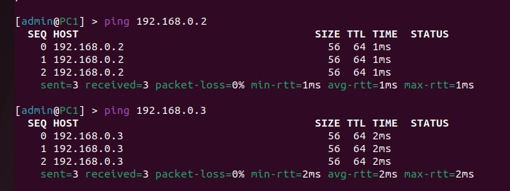
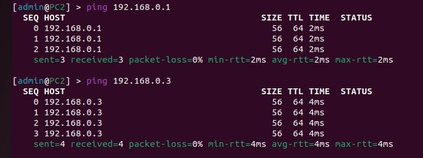
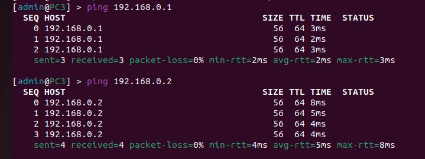

University: <a href="https://itmo.ru/ru/">ITMO University</a>

Faculty: <a href="https://fict.itmo.ru">FICT</a>

Course: <a href="https://github.com/itmo-ict-faculty/introduction-in-routing">Introduction in routing</a>

Year: 2022/2023

Group: K33212

Author: Potitova Valentina Alexandrovna

Lab: Lab4

Date of create: 30.12.2022

Date of finished: 13.01.2023

<h1>Лаборторная работа №4</h1>
<h2>Эмуляция распределенной корпоративной сети связи, настройка iBGP, организация L3VPN, VPLS</h2>

<h3>Цель работы</h3>

Изучить протоколы BGP, MPLS и правила организации L3VPN и VPLS.

<h3>Результаты работы</h3>

<ul>
<li>Файл, который использовался для развертывания тестовой сети находится в папке с лабораторной работой. Имя файла: "lab4.yaml".</li>
</ul>

<h4>Cхема связи</h4>

<h4>Текст конфигураций для каждого сетевого устройства</h4>
<h5>Часть 1</h5>
<h6>R01.NY</h6>
<pre><code>
/interface bridge
add name=Lo
/interface wireless security-profiles
set [ find default=yes ] supplicant-identity=MikroTik
/routing bgp instance
set default redistribute-connected=yes router-id=1.1.1.1
/routing ospf instance
set [ find default=yes ] router-id=1.1.1.1
/ip address
add address=172.31.255.30/30 interface=ether1 network=172.31.255.28
add address=172.16.1.1/24 interface=ether3 network=172.16.1.0
add address=192.168.1.1/24 interface=ether2 network=192.168.1.0
add address=1.1.1.1 interface=Lo network=1.1.1.1
/ip dhcp-client
add disabled=no interface=ether1
/ip route vrf
add export-route-targets=65530:10 import-route-targets=65530:10 interfaces=ether2 route-distinguisher=65530:10 routing-mark=VRF_DEVOPS
/mpls ldp
set enabled=yes
/mpls ldp interface
add interface=ether3
/routing bgp instance vrf
add redistribute-connected=yes routing-mark=VRF_DEVOPS
/routing bgp peer
add address-families=ip,l2vpn,l2vpn-cisco,vpnv4 name=peer1 remote-address=2.2.2.2 remote-as=65530 update-source=Lo
/routing ospf network
add area=backbone
/system identity
set name=R01.NY
</pre></code>

<h6>R01.LND</h6>
<pre><code>
/interface bridge
add name=Lo
/interface wireless security-profiles
set [ find default=yes ] supplicant-identity=MikroTik
/routing bgp instance
set default router-id=2.2.2.2
/routing ospf instance
set [ find default=yes ] router-id=2.2.2.2
/ip address
add address=172.31.255.30/30 interface=ether1 network=172.31.255.28
add address=2.2.2.2 interface=Lo network=2.2.2.2
add address=172.16.1.2/24 interface=ether2 network=172.16.1.0
add address=172.16.3.1/24 interface=ether3 network=172.16.3.0
add address=172.16.2.1/24 interface=ether4 network=172.16.2.0
/ip dhcp-client
add disabled=no interface=ether1
/mpls ldp
set enabled=yes
/mpls ldp interface
add interface=ether2
add interface=ether3
add interface=ether4
/routing bgp peer
add address-families=ip,l2vpn,l2vpn-cisco,vpnv4 name=peer1 remote-address=1.1.1.1 remote-as=65530 update-source=Lo
add address-families=ip,l2vpn,l2vpn-cisco,vpnv4 name=peer2 remote-address=3.3.3.3 remote-as=65530 route-reflect=yes update-source=Lo
add address-families=ip,l2vpn,l2vpn-cisco,vpnv4 name=peer3 remote-address=5.5.5.5 remote-as=65530 route-reflect=yes update-source=Lo
/routing ospf network
add area=backbone
/system identity
set name=R01.LND
</pre></code>

<h6>R01.HKI</h6>
<pre><code>
/interface bridge
add name=Lo
/interface wireless security-profiles
set [ find default=yes ] supplicant-identity=MikroTik
/routing bgp instance
set default router-id=3.3.3.3
/routing ospf instance
set [ find default=yes ] router-id=3.3.3.3
/ip address
add address=172.31.255.30/30 interface=ether1 network=172.31.255.28
add address=172.16.2.2/24 interface=ether2 network=172.16.2.0
add address=172.16.4.1/24 interface=ether3 network=172.16.4.0
add address=172.16.5.1/24 interface=ether4 network=172.16.5.0
add address=3.3.3.3 interface=Lo network=3.3.3.3
/ip dhcp-client
add disabled=no interface=ether2
/mpls ldp
set enabled=yes
/mpls ldp interface
add interface=ether2
add interface=ether3
add interface=ether4
/routing bgp peer
add address-families=ip,l2vpn,l2vpn-cisco,vpnv4 name=peer1 remote-address=2.2.2.2 remote-as=65530 route-reflect=yes update-source=Lo
add address-families=ip,l2vpn,l2vpn-cisco,vpnv4 name=peer2 remote-address=5.5.5.5 remote-as=65530 route-reflect=yes update-source=Lo
add address-families=ip,l2vpn,l2vpn-cisco,vpnv4 name=peer3 remote-address=4.4.4.4 remote-as=65530 update-source=Lo
/routing ospf network
add area=backbone
/system identity
set name=R01.HKI
</pre></code>

<h6>R01.SPB</h6>
<pre><code>
/interface bridge
add name=Lo
/interface wireless security-profiles
set [ find default=yes ] supplicant-identity=MikroTik
/routing bgp instance
set default router-id=4.4.4.4
/routing ospf instance
set [ find default=yes ] router-id=4.4.4.4
/ip address
add address=172.31.255.30/30 interface=ether1 network=172.31.255.28
add address=172.16.4.2/24 interface=ether3 network=172.16.4.0
add address=192.168.2.1/24 interface=ether2 network=192.168.2.0
add address=4.4.4.4 interface=Lo network=4.4.4.4
/ip dhcp-client
add disabled=no interface=ether1
/ip route vrf
add export-route-targets=65530:10 import-route-targets=65530:10 interfaces=ether2 route-distinguisher=65530:10 routing-mark=VRF_DEVOPS
/mpls ldp
set enabled=yes
/mpls ldp interface
add interface=ether3
/routing bgp instance vrf
add redistribute-connected=yes routing-mark=VRF_DEVOPS
/routing bgp peer
add address-families=ip,l2vpn,l2vpn-cisco,vpnv4 name=peer1 remote-address=3.3.3.3 remote-as=65530 update-source=Lo
/routing ospf network
add area=backbone
/system identity
set name=R01.SPB
</pre></code>

<h6>R01.LBN</h6>
<pre><code>
/interface bridge
add name=Lo
/interface wireless security-profiles
set [ find default=yes ] supplicant-identity=MikroTik
/routing bgp instance
set default router-id=5.5.5.5
/routing ospf instance
set [ find default=yes ] router-id=5.5.5.5
/ip address
add address=172.31.255.30/30 interface=ether1 network=172.31.255.28
add address=172.16.3.2/24 interface=ether2 network=172.16.3.0
add address=172.16.5.2/24 interface=ether3 network=172.16.5.0
add address=172.16.6.1/24 interface=ether4 network=172.16.6.0
add address=5.5.5.5 interface=Lo network=5.5.5.5
/ip dhcp-client
add disabled=no interface=ether1
/mpls ldp
set enabled=yes
/mpls ldp interface
add interface=ether2
add interface=ether3
add interface=ether4
/routing bgp peer
add address-families=ip,l2vpn,l2vpn-cisco,vpnv4 name=peer1 remote-address=2.2.2.2 remote-as=65530 route-reflect=yes update-source=Lo
add address-families=ip,l2vpn,l2vpn-cisco,vpnv4 name=peer2 remote-address=3.3.3.3 remote-as=65530 route-reflect=yes update-source=Lo
add address-families=ip,l2vpn,l2vpn-cisco,vpnv4 name=peer3 remote-address=6.6.6.6 remote-as=65530 update-source=Lo
/routing ospf network
add area=backbone
/system identity
set name=R01.LBN
</pre></code>

<h6>R01.SVL</h6>
<pre><code>
/interface bridge
add name=Lo
/interface wireless security-profiles
set [ find default=yes ] supplicant-identity=MikroTik
/routing bgp instance
set default router-id=6.6.6.6
/routing ospf instance
set [ find default=yes ] router-id=6.6.6.6
/ip address
add address=172.31.255.30/30 interface=ether1 network=172.31.255.28
add address=172.16.6.2/24 interface=ether3 network=172.16.6.0
add address=192.168.3.1/24 interface=ether2 network=192.168.3.0
add address=6.6.6.6 interface=Lo network=6.6.6.6
/ip dhcp-client
add disabled=no interface=ether1
/ip route vrf
add export-route-targets=65530:10 import-route-targets=65530:10 interfaces=ether2 route-distinguisher=65530:10 routing-mark=VRF_DEVOPS
/mpls ldp
set enabled=yes
/mpls ldp interface
add interface=ether3
/routing bgp instance vrf
add redistribute-connected=yes routing-mark=VRF_DEVOPS
/routing bgp peer
add address-families=ip,l2vpn,l2vpn-cisco,vpnv4 name=peer1 remote-address=5.5.5.5 remote-as=65530 update-source=Lo
/routing ospf network
add area=backbone
/system identity
set name=R01.SVL
</pre></code>

<h4>Результаты пингов, проверки связности между VRF</h4>

<h5>Часть 2</h5>

<h6>R01.NY</h6>
<pre><code>
/interface bridge
add name=Lo
add name=VPLS
/interface vpls
add disabled=no l2mtu=1500 mac-address=02:50:77:C9:83:17 name=vpls1 remote-peer=4.4.4.4 vpls-id=10:0
add disabled=no l2mtu=1500 mac-address=02:70:21:37:82:29 name=vpls2 remote-peer=6.6.6.6 vpls-id=10:0
/interface wireless security-profiles
set [ find default=yes ] supplicant-identity=MikroTik
/routing bgp instance
set default redistribute-connected=yes router-id=1.1.1.1
/routing ospf instance
set [ find default=yes ] router-id=1.1.1.1
/interface bridge port
add bridge=VPLS interface=vpls1
add bridge=VPLS interface=vpls2
add bridge=VPLS interface=ether2
/ip address
add address=172.31.255.30/30 interface=ether1 network=172.31.255.28
add address=172.16.1.1/24 interface=ether3 network=172.16.1.0
add address=192.168.1.1/24 interface=ether2 network=192.168.1.0
add address=1.1.1.1 interface=Lo network=1.1.1.1
/ip dhcp-client
add disabled=no interface=ether1
/mpls ldp
set enabled=yes
/mpls ldp interface
add interface=ether3
/routing bgp peer
add address-families=ip,l2vpn,l2vpn-cisco,vpnv4 name=peer1 remote-address=2.2.2.2 remote-as=65530 update-source=Lo
/routing ospf network
add area=backbone
/system identity
set name=R01.NY
</pre></code>

<h6>R01.SPB</h6>
<pre><code>
/interface bridge
add name=Lo
add name=VPLS
/interface vpls
add disabled=no l2mtu=1500 mac-address=02:16:9C:76:7F:58 name=vpls1 remote-peer=1.1.1.1 vpls-id=10:0
add disabled=no l2mtu=1500 mac-address=02:47:8C:E3:86:3D name=vpls2 remote-peer=6.6.6.6 vpls-id=10:0
/interface wireless security-profiles
set [ find default=yes ] supplicant-identity=MikroTik
/routing bgp instance
set default router-id=4.4.4.4
/routing ospf instance
set [ find default=yes ] router-id=4.4.4.4
/interface bridge port
add bridge=VPLS interface=vpls1
add bridge=VPLS interface=vpls2
add bridge=VPLS interface=ether2
/ip address
add address=172.31.255.30/30 interface=ether1 network=172.31.255.28
add address=172.16.4.2/24 interface=ether3 network=172.16.4.0
add address=192.168.2.1/24 interface=ether2 network=192.168.2.0
add address=4.4.4.4 interface=Lo network=4.4.4.4
/ip dhcp-client
add disabled=no interface=ether1
/mpls ldp
set enabled=yes
/mpls ldp interface
add interface=ether3
/routing bgp peer
add address-families=ip,l2vpn,l2vpn-cisco,vpnv4 name=peer1 remote-address=3.3.3.3 remote-as=65530 update-source=Lo
/routing ospf network
add area=backbone
/system identity
set name=R01.SPB
</pre></code>

<h6>R01.SVL</h6>
<pre><code>
/interface bridge
add name=Lo
add name=VPLS
/interface vpls
add disabled=no l2mtu=1500 mac-address=02:43:F0:2A:36:87 name=vpls1 remote-peer=1.1.1.1 vpls-id=10:0
add disabled=no l2mtu=1500 mac-address=02:D3:DD:A1:64:78 name=vpls2 remote-peer=4.4.4.4 vpls-id=10:0
/interface wireless security-profiles
set [ find default=yes ] supplicant-identity=MikroTik
/routing bgp instance
set default router-id=6.6.6.6
/routing ospf instance
set [ find default=yes ] router-id=6.6.6.6
/interface bridge port
add bridge=VPLS interface=vpls1
add bridge=VPLS interface=vpls2
add bridge=VPLS interface=ether2
/ip address
add address=172.31.255.30/30 interface=ether1 network=172.31.255.28
add address=172.16.6.2/24 interface=ether3 network=172.16.6.0
add address=192.168.3.1/24 interface=ether2 network=192.168.3.0
add address=6.6.6.6 interface=Lo network=6.6.6.6
/ip dhcp-client
add disabled=no interface=ether1
/mpls ldp
set enabled=yes
/mpls ldp interface
add interface=ether3
/routing bgp peer
add address-families=ip,l2vpn,l2vpn-cisco,vpnv4 name=peer1 remote-address=5.5.5.5 remote-as=65530 update-source=Lo
/routing ospf network
add area=backbone
/system identity
set name=R01.SVL
</pre></code>

<h6>R01.PC1</h6>
<pre><code>
/interface wireless security-profiles
set [ find default=yes ] supplicant-identity=MikroTik
/ip address
add address=172.31.255.30/30 interface=ether1 network=172.31.255.28
add address=192.168.2.2/24 interface=ether2 network=192.168.2.0
add address=192.168.0.1/24 interface=ether2 network=192.168.0.0
/ip dhcp-client
add disabled=no interface=ether2
/system identity
set name=PC1
</pre></code>

<h6>R01.PC2</h6>
<pre><code>
/interface wireless security-profiles
set [ find default=yes ] supplicant-identity=MikroTik
/ip address
add address=172.31.255.30/30 interface=ether1 network=172.31.255.28
add address=192.168.1.2/24 interface=ether2 network=192.168.1.0
add address=192.168.0.2/24 interface=ether2 network=192.168.0.0
/ip dhcp-client
add disabled=no interface=ether1
/system identity
set name=PC2
</pre></code>

<h6>R01.PC3</h6>
<pre><code>
/interface wireless security-profiles
set [ find default=yes ] supplicant-identity=MikroTik
/ip address
add address=172.31.255.30/30 interface=ether1 network=172.31.255.28
add address=192.168.3.2/24 interface=ether2 network=192.168.3.0
add address=192.168.0.3/24 interface=ether2 network=192.168.0.0
/ip dhcp-client
add disabled=no interface=ether1
/system identity
set name=PC3
</pre></code>

<h4>Результаты пингов, проверки локальной связности</h4>

<h3>Вывод</h3>

Были изучены протоколы BGP, MPLS и правила организации L3VPN и VPLS.
